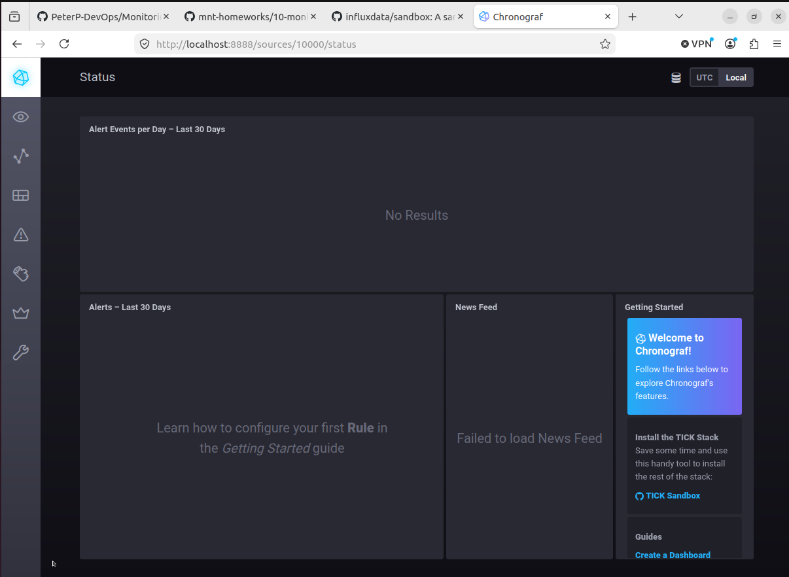
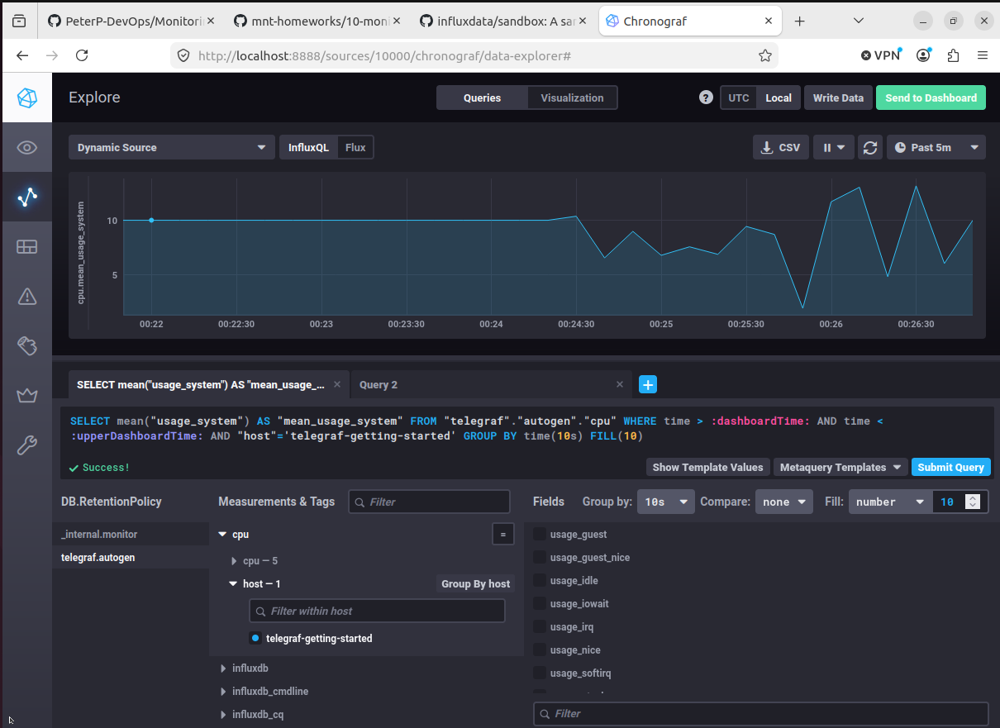
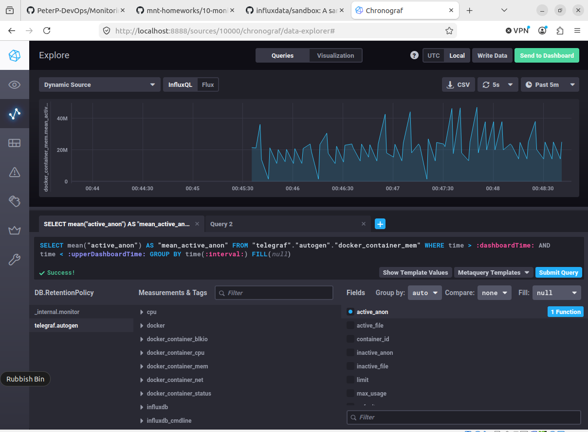

# Домашнее задание к занятию «Системы мониторинга» - Петр Петров

### Обязательные задания

*1.* Вас пригласили настроить мониторинг на проект. На онбординге вам рассказали, что проект представляет из себя платформу для вычислений с выдачей текстовых отчетов, которые сохраняются на диск. Взаимодействие с платформой осуществляется по протоколу http. Также вам отметили, что вычисления загружают ЦПУ. Какой минимальный набор метрик вы выведите в мониторинг и почему?  

**Ответ**

- Доступность сервиса — успешность HTTP-запросов.
- Производительность сервиса — количество запросов и время ответа.
- Загрузка CPU.
- Свободное место на диске, поскольку отчеты сохраняются локально.
- Количество успешно сформированных и неуспешных отчетов.


*2.* Менеджер продукта посмотрев на ваши метрики сказал, что ему непонятно что такое RAM/inodes/CPUla. Также он сказал, что хочет понимать, насколько мы выполняем свои обязанности перед клиентами и какое качество обслуживания. Что вы можете ему предложить?

**Ответ**

Инфраструктурные метрики важны для инженеров. Для отображения качества сервиса для клиента необходимо внедрить SLI/SLO.

Для данной платформы ключевыми SLI могут быть:

- процент успешных запросов;
- процент успешно сформированных отчетов;
- время генерации отчетов;
- доступность сервиса.

Для каждого SLI определяются целевые значения (SLO), например 99.9% успешных запросов и 95% отчетов, построенных менее чем за 30 секунд. Такой набор метрик позволит понимать не состояние серверов, а качество обслуживания клиентов и выполнение обязательств перед ними.

*3.* Вашей DevOps команде в этом году не выделили финансирование на построение системы сбора логов. Разработчики в свою очередь хотят видеть все ошибки, которые выдают их приложения. Какое решение вы можете предпринять в этой ситуации, чтобы разработчики получали ошибки приложения?

**Ответ**

Если разработчиком необходимо видеть ошибки приложения, то не обязательно собирать все логи. Я бы добавил в приложение метрики ошибок и исключений (например, по типам исключений), настроил алерты через Prometheus и Alertmanager и вывел статистику в Grafana.

*4.* Вы, как опытный SRE, сделали мониторинг, куда вывели отображения выполнения SLA=99% по http кодам ответов. Вычисляете этот параметр по следующей формуле: summ_2xx_requests/summ_all_requests. Данный параметр не поднимается выше 70%, но при этом в вашей системе нет кодов ответа 5xx и 4xx. Где у вас ошибка?  

**Ответ**


Скорее всего, в расчет попадают HTTP-коды 3xx. Формула считает успешными только ответы 2xx, однако редиректы (301, 302, 304, 307 и т.д.) не являются ошибками и могут составлять значительную долю трафика. В результате при отсутствии 4xx и 5xx значение получается около 70%. Для начала я бы проверил распределение кодов ответов по всем классам 1xx–5xx.

*5.* Опишите основные плюсы и минусы pull и push систем мониторинга

**Ответ**

Pull-модель позволяет централизованно собирать метрики и легко определять недоступность целей, поэтому она хорошо подходит для Prometheus и динамической инфраструктуры вроде Kubernetes. Основные недостатки — необходимость сетевой доступности целей и сложности с мониторингом краткоживущих задач. Push-модель удобна для систем за NAT, временных процессов и распределенных площадок, однако усложняет определение отказов агентов и требует настройки отправки данных на каждом источнике метрик. В современных облачных инфраструктурах чаще используется Pull, а Push применяется для специальных случаев, таких как batch-job или удаленные площадки

*6.* Какие из ниже перечисленных систем относятся к push модели, а какие к pull? А может есть гибридные?

- Prometheus
- TICK
- Zabbix
- VictoriaMetrics
- Nagios

**Ответ**

Чистыми представителями являются Prometheus (Pull) и TICK (Push). Zabbix и VictoriaMetrics можно считать гибридными решениями, поскольку они поддерживают оба способа доставки метрик. Nagios исторически относится к Pull-системам, но через механизм passive checks также может принимать результаты проверок по Push-модели.

*7.* Склонируйте себе репозиторий и запустите TICK-стэк, используя технологии docker и docker-compose.
В виде решения на это упражнение приведите скриншот веб-интерфейса ПО chronograf `(http://localhost:8888)`.

P.S.: если при запуске некоторые контейнеры будут падать с ошибкой - проставьте им режим `Z`, например `./data:/var/lib:Z`

**Ответ**



*8.* Перейдите в веб-интерфейс Chronograf (http://localhost:8888) и откройте вкладку Data explorer.

- Нажмите на кнопку Add a query
- Изучите вывод интерфейса и выберите БД telegraf.autogen
- В measurments выберите cpu->host->telegraf-getting-started, а в fields выберите usage_system. Внизу появится график утилизации cpu.
- Вверху вы можете увидеть запрос, аналогичный SQL-синтаксису. Поэкспериментируйте с запросом, попробуйте изменить группировку и интервал наблюдений.
Для выполнения задания приведите скриншот с отображением метрик утилизации cpu из веб-интерфейса.


**Ответ**



*9.* Изучите список telegraf inputs. Добавьте в конфигурацию telegraf следующий плагин - docker:

```
[[inputs.docker]]
  endpoint = "unix:///var/run/docker.sock"
```

Дополнительно вам может потребоваться донастройка контейнера telegraf в docker-compose.yml дополнительного volume и режима privileged:

```
  telegraf:
    image: telegraf:1.4.0
    privileged: true
    volumes:
      - ./etc/telegraf.conf:/etc/telegraf/telegraf.conf:Z
      - /var/run/docker.sock:/var/run/docker.sock:Z
    links:
      - influxdb
    ports:
      - "8092:8092/udp"
      - "8094:8094"
      - "8125:8125/udp"
```

После настройке перезапустите telegraf, обновите веб интерфейс и приведите скриншотом список measurments в веб-интерфейсе базы telegraf.autogen . Там должны появиться метрики, связанные с docker.

Факультативно можете изучить какие метрики собирает telegraf после выполнения данного задания.

**Ответ**



